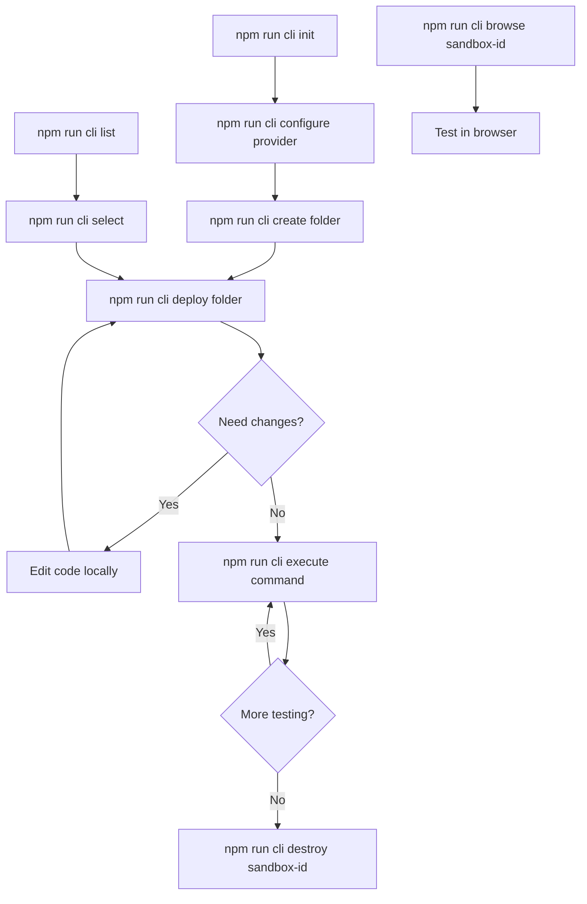

## Command Categories

Sandbox CLI commands are organized into logical groups for different aspects of sandbox management:

<CardGroup cols={2}>
  <Card
    title="Lifecycle Commands"
    icon="recycle"
  >
    Create, deploy, and destroy sandboxes
  </Card>
  <Card
    title="Management Commands"
    icon="list"
  >
    List, select, and browse sandboxes
  </Card>
  <Card
    title="Execution Commands"
    icon="terminal"
  >
    Run commands in sandbox environments
  </Card>
  <Card
    title="Configuration Commands"
    icon="gear"
  >
    Set up and manage providers
  </Card>
</CardGroup>

## Quick Reference

### Lifecycle Commands

<CodeGroup>
```bash Create Sandbox
npm run cli create <folder> [--provider <name>] [--dockerfile <path>]
```

```bash Deploy Code
npm run cli deploy <folder> [--dockerfile <path>]
```

```bash Destroy Sandbox
npm run cli destroy <sandbox-id>
```
</CodeGroup>

### Management Commands

<CodeGroup>
```bash List Sandboxes
npm run cli list
```

```bash Select Current Sandbox
npm run cli select
```

```bash Browse Sandbox
npm run cli browse <sandbox-id>
```
</CodeGroup>

### Execution Commands

<CodeGroup>
```bash Execute Command
npm run cli execute "<command>" [--cwd <dir>] [--timeout <sec>] [--no-stream]
```
</CodeGroup>

### Configuration Commands

<CodeGroup>
```bash Initialize Configuration
npm run cli init
```

```bash Configure Provider
npm run cli configure <provider>
```
</CodeGroup>

## Command Workflow

Understanding the typical command flow helps optimize your development process:



## Command Details

### Core Workflow Commands

<AccordionGroup>
  <Accordion title="create - Create New Sandbox">
    **Purpose**: Creates a new sandbox environment with your application
    
    **Syntax**: 
    ```bash
    npm run cli create <folder> [options]
    ```
    
    **Options**:
    - `--provider <name>`: Specify provider (daytona, azure)
    - `--dockerfile <path>`: Custom Dockerfile path (default: ./Dockerfile)
    
    **What it does**:
    - Builds Docker image from your application
    - Creates sandbox environment on chosen provider
    - Sets the new sandbox as current active sandbox
    - Stores metadata for future operations
  </Accordion>

  <Accordion title="deploy - Deploy Code Updates">
    **Purpose**: Deploys code changes to existing sandbox
    
    **Syntax**: 
    ```bash
    npm run cli deploy <folder> [options]
    ```
    
    **Options**:
    - `--dockerfile <path>`: Update with new Dockerfile (optional)
    
    **What it does**:
    - Uploads your latest code to current sandbox
    - Rebuilds application if Dockerfile provided
    - Much faster than creating new sandbox
    - Preserves sandbox URL and configuration
  </Accordion>

  <Accordion title="destroy - Clean Up Sandbox">
    **Purpose**: Permanently removes a sandbox and all its data
    
    **Syntax**: 
    ```bash
    npm run cli destroy <sandbox-id>
    ```
    
    **What it does**:
    - Stops and removes the sandbox container
    - Deletes all associated resources
    - Removes sandbox from local metadata
    - Cannot be undone
  </Accordion>
</AccordionGroup>

### Management Commands

<AccordionGroup>
  <Accordion title="list - View All Sandboxes">
    **Purpose**: Shows all your sandboxes across all providers
    
    **Syntax**: 
    ```bash
    npm run cli list
    ```
    
    **Information shown**:
    - Sandbox ID and name
    - Provider and status
    - Creation date and deployment count
    - Access URL
    - Current sandbox indicator (← CURRENT)
  </Accordion>

  <Accordion title="select - Switch Active Sandbox">
    **Purpose**: Changes which sandbox receives deploy and execute commands
    
    **Syntax**: 
    ```bash
    npm run cli select
    ```
    
    **Interactive process**:
    - Shows list of available sandboxes
    - Allows selection via arrow keys
    - Updates current sandbox setting
  </Accordion>

  <Accordion title="browse - Open in Browser">
    **Purpose**: Opens sandbox application URL in your default browser
    
    **Syntax**: 
    ```bash
    npm run cli browse <sandbox-id>
    ```
    
    **What it does**:
    - Retrieves sandbox URL
    - Opens URL in default browser
    - Works with all providers
  </Accordion>
</AccordionGroup>

### Execution Commands

<AccordionGroup>
  <Accordion title="execute - Run Commands in Sandbox">
    **Purpose**: Executes commands directly in sandbox environment
    
    **Syntax**: 
    ```bash
    npm run cli execute "<command>" [options]
    ```
    
    **Options**:
    - `--cwd <directory>`: Working directory (default: /workspaces/project)
    - `--timeout <seconds>`: Command timeout (default: 300)
    - `--no-stream`: Get all output at once instead of streaming
    
    **Provider Support**:
    - ✅ Daytona: Full support with real-time streaming
    - ❌ Azure ACI: Limited support (coming soon)
    - 🚧 E2B: Planned
  </Accordion>
</AccordionGroup>

### Configuration Commands

<AccordionGroup>
  <Accordion title="init - Initialize Configuration">
    **Purpose**: Sets up initial Sandbox CLI configuration
    
    **Syntax**: 
    ```bash
    npm run cli init
    ```
    
    **What it does**:
    - Creates ~/.sandbox-cli/config.json
    - Prompts for default provider selection
    - Sets up basic configuration structure
  </Accordion>

  <Accordion title="configure - Set Up Providers">
    **Purpose**: Configures authentication and settings for providers
    
    **Syntax**: 
    ```bash
    npm run cli configure <provider>
    ```
    
    **Supported providers**:
    - `daytona`: Requires API key and server URL
    - `azure`: Requires subscription, resource group, registry
    - `e2b`: Coming soon
  </Accordion>
</AccordionGroup>

## Command Examples by Use Case

### First-Time Setup

<Steps>
  <Step title="Initialize">
    ```bash
    npm run cli init
    ```
  </Step>
  
  <Step title="Configure Provider">
    ```bash
    npm run cli configure daytona
    ```
  </Step>
  
  <Step title="Create First Sandbox">
    ```bash
    npm run cli create ./my-app --provider daytona
    ```
  </Step>
</Steps>

### Daily Development

<Steps>
  <Step title="Check Current Sandboxes">
    ```bash
    npm run cli list
    ```
  </Step>
  
  <Step title="Deploy Latest Changes">
    ```bash
    npm run cli deploy ./my-app
    ```
  </Step>
  
  <Step title="Test Application">
    ```bash
    npm run cli browse <sandbox-id>
    ```
  </Step>
  
  <Step title="Debug Issues">
    ```bash
    npm run cli execute "npm run test"
    npm run cli execute "cat /var/log/app.log"
    ```
  </Step>
</Steps>

### Multi-Project Workflow

<Steps>
  <Step title="Switch Projects">
    ```bash
    npm run cli select
    # Choose different sandbox
    ```
  </Step>
  
  <Step title="Deploy to Selected Sandbox">
    ```bash
    npm run cli deploy ./different-project
    ```
  </Step>
  
  <Step title="Compare Environments">
    ```bash
    npm run cli list
    # Note URLs for different projects
    ```
  </Step>
</Steps>

## Command Tips and Best Practices

### Performance Optimization

<Tip>
  **Use `deploy` instead of `create`** for iterative development. It's much faster since it reuses the existing sandbox infrastructure.
</Tip>

<Tip>
  **Keep sandboxes running** during active development. Creating new sandboxes takes longer than deploying to existing ones.
</Tip>

### Resource Management

<Warning>
  **Clean up unused sandboxes** regularly with `destroy` to avoid unnecessary costs and resource usage.
</Warning>

<Info>
  **Use `list` frequently** to keep track of your sandboxes and their status across different providers.
</Info>

### Command Execution Best Practices

<CodeGroup>
```bash Short Commands
npm run cli execute "ls -la"
npm run cli execute "pwd"
```

```bash Long-Running Commands
npm run cli execute "npm run build" --timeout 600
npm run cli execute "npm test" --timeout 300
```

```bash Background Processes
npm run cli execute "nohup npm start > app.log 2>&1 &"
```
</CodeGroup>

## Error Handling

Common command errors and solutions:

<AccordionGroup>
  <Accordion title="No current sandbox selected">
    **Error**: Commands fail because no sandbox is active
    
    **Solution**: 
    ```bash
    npm run cli select
    # or
    npm run cli create ./my-app
    ```
  </Accordion>
  
  <Accordion title="Provider not configured">
    **Error**: Authentication fails for provider
    
    **Solution**: 
    ```bash
    npm run cli configure <provider>
    ```
  </Accordion>
  
  <Accordion title="Sandbox not found">
    **Error**: Trying to operate on non-existent sandbox
    
    **Solution**: 
    ```bash
    npm run cli list  # Check available sandboxes
    npm run cli select  # Choose valid sandbox
    ```
  </Accordion>
</AccordionGroup>

## Next Steps

Dive deeper into specific commands:

<CardGroup cols={2}>
  <Card
    title="Master Execute Command"
    icon="terminal"
    href="/commands/execute"
  >
    Learn advanced command execution
  </Card>
  <Card
    title="Deployment Strategies"
    icon="rocket"
    href="/commands/deploy"
  >
    Optimize your deployment workflow
  </Card>
  <Card
    title="Sandbox Management"
    icon="list"
    href="/commands/list"
  >
    Efficiently manage multiple sandboxes
  </Card>
  <Card
    title="Best Practices"
    icon="star"
    href="/guides/best-practices"
  >
    Learn workflow optimization
  </Card>
</CardGroup>